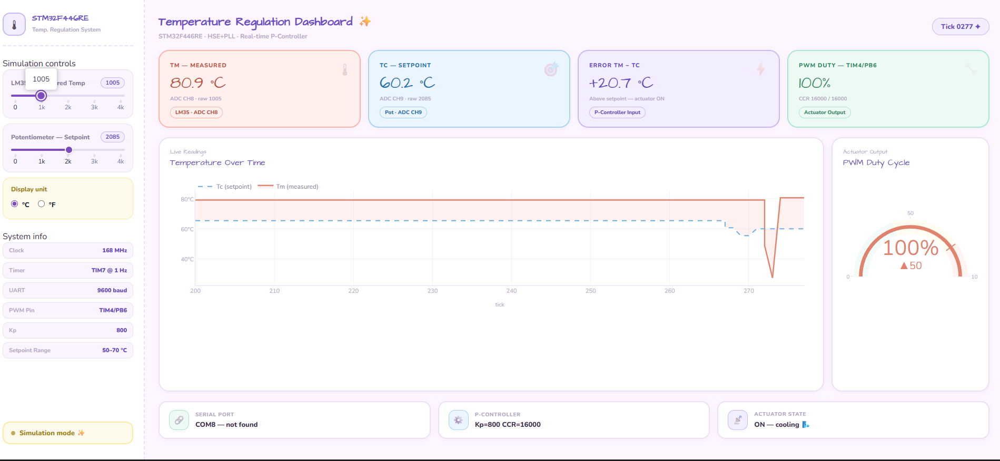
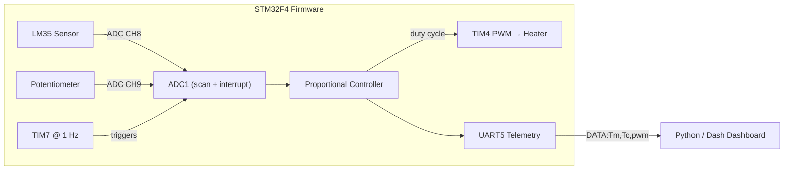

# 🌡️ STM32 PID Temperature Regulation System

**Embedded closed-loop temperature control on an STM32F4, with a live Python dashboard for monitoring and tuning.**

A hardware setpoint (potentiometer) and a real sensor (LM35) feed a proportional controller running on bare-metal STM32 firmware. The controller drives a PWM-controlled heating element and streams live telemetry over UART to a desktop dashboard for visualization.

<p align="left">
  
  
  
  
</p>

> 📸 

---

## ⏱️ Summary

- **What it is:** a PID-style temperature controller — sensor → control law → PWM actuator — implemented from scratch on STM32 HAL, with a custom C++ peripheral abstraction layer.
- **What it does:** reads temperature (LM35) and a target setpoint (potentiometer) via interrupt-driven ADC, computes a proportional control output, drives a PWM heater, and reports everything over UART in real time.
- **What ships with it:** a Python/Dash dashboard that parses the live UART stream (or runs in simulation mode with no board attached) and plots measured vs. setpoint temperature and actuator duty cycle.

## 🧠 Skills Demonstrated

| Area | Details |
|---|---|
| **Embedded C++** | Custom object-oriented wrapper around STM32 HAL (GPIO, timers, ADC, UART) — not just copy-pasted CubeMX code |
| **Real-time systems** | Interrupt-driven sensor sampling (ADC ISR), fixed-rate control loop (TIM7 @ 1 Hz), non-blocking main loop |
| **Control theory** | Sensor scaling, setpoint mapping, proportional control law with output saturation |
| **Firmware ↔ software integration** | Defined a simple serial telemetry protocol and built a PC-side consumer for it |
| **Data visualization / tooling** | Live dashboard (Dash + Plotly) with graceful fallback to simulation mode when no hardware is connected |

## 🏗️ System Architecture



## 📁 Repository Structure

```
stm32-temp-control/
├── firmware/                  # STM32CubeIDE project sources
│   └── Core/
│       ├── Inc/
│       │   ├── main.h
│       │   └── stm_Cdriver.hpp   # GPIO / timer / ADC / UART wrapper classes
│       └── Src/
│           ├── main.cpp           # App logic + control loop + ISRs
│           └── stm_Cdriver.cpp
├── dashboard/
│   ├── stm32_dashboard.py     # Live/simulated monitoring dashboard
│   └── requirements.txt
├── docs/
│   └── screenshots/           
├── LICENSE
└── README.md
```

## 🔌 Hardware

| Signal | Pin | Peripheral | Notes |
|---|---|---|---|
| LM35 temperature sensor | PB0 | ADC1_CH8 | Analog input |
| Potentiometer (setpoint) | PB1 | ADC1_CH9 | Maps to a 50–70 °C setpoint range |
| Heater PWM output | PB6 | TIM4_CH1 | Drives heating element via MOSFET/driver |
| Status LEDs (×4) | PD12–PD15 | GPIO output | Sequential heartbeat pattern, updated every control tick |
| Mode LED | PA5 | GPIO output (open-drain) | Toggled by the button |
| Mode button | PA0 | EXTI0 (rising edge) | Reserved for a °C/°F display toggle |
| UART5 TX / RX | PC12 / PD2 | UART5 | 9600 baud, 8N1 — telemetry to the dashboard |

**Clock:** HSE-driven PLL → SYSCLK = 168 MHz, APB1 = 42 MHz, APB2 = 84 MHz.
**Control tick:** TIM7 (prescaler 8399, period 9999) → **1 Hz** control loop rate.

## ⚙️ Control Loop

1. `TIM7` fires once per second → advances the LED heartbeat → kicks off an ADC conversion.
2. `ADC_IRQHandler` alternates between reading the LM35 and the potentiometer.
3. Main loop, once both readings are in:
   - Converts the LM35 raw ADC code to °C (`Tm`).
   - Maps the potentiometer code to a setpoint `Tc` between 50–70 °C.
   - Runs `regPID()` — a proportional law (`Kp = 800`, error = `Tm − Tc`), saturated at the max PWM value.
   - Updates the TIM4 duty cycle driving the heater.
   - Sends `DATA:<Tm>,<Tc>,<pwm>\r\n` over UART5.

## 📡 Telemetry Protocol

```
DATA:<measured_temp_C>,<setpoint_temp_C>,<pwm_value>\r\n
```
Example: `DATA:52,60,6400`

## 📊 Dashboard

`dashboard/stm32_dashboard.py` is a Dash app that:
- Reads the live `DATA:` stream from the board over serial, **or** falls back to a **simulation mode** (with sliders for LM35/pot raw values) if no board is connected — so the dashboard is fully explorable without hardware.
- Plots measured temperature vs. setpoint over time, and actuator PWM duty as a gauge.
- Displays live system parameters (clock speed, timer rate, Kp, setpoint range) and connection status.

```bash
cd dashboard
pip install -r requirements.txt
python stm32_dashboard.py
# open http://127.0.0.1:8050
```

> Set `SERIAL_PORT` at the top of `stm32_dashboard.py` to match your board's COM/tty port.

## 🛠️ Building & Flashing the Firmware

1. Open `firmware/` in **STM32CubeIDE** (or import as an existing project).
2. Adjust `stm32f4xx_hal_conf.h` / clock config if your target board differs from the one assumed here.
3. Build and flash via ST-Link.
4. Connect UART5 (PC12/PD2) to a USB-serial adapter at 9600 baud and point the dashboard at that port.

## 🚧 Roadmap / Possible Extensions

- [ ] Add integral and derivative terms (full PID) to remove steady-state offset
- [ ] Wire up the °C/°F button toggle to the dashboard/telemetry
- [ ] Moving-average filtering on the LM35 ADC channel to reduce noise
- [ ] Log telemetry to CSV for offline analysis

## 📄 License

MIT — see [LICENSE](LICENSE).
